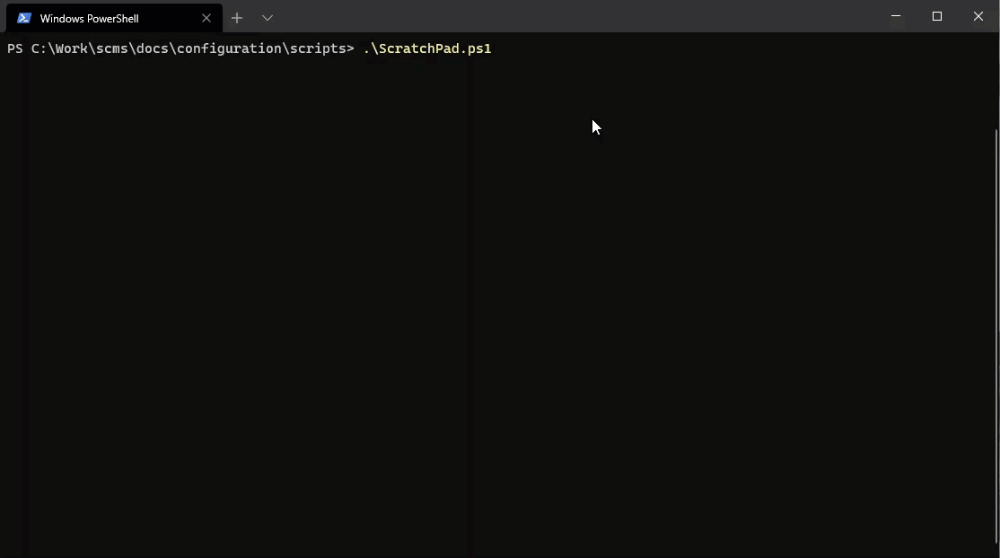

# Spe Content Migrator

Script used to migrate content between Sitecore instances using Sitecore PowerShell Extensions.



## Getting Started

Prerequisites:

* Unicorn and Rainbow are deployed to your Sitecore instances.
* Spe 6.0+ is installed and SPE Remoting is enabled on your Sitecore instances.

Running:

```powershell
Clear-Host

$scriptDirectory = & {
    if ($psISE) {
        Split-Path -Path $psISE.CurrentFile.FullPath        
    } else {
        $PSScriptRoot
    }
}
. "$($scriptDirectory)\Copy-RainbowContent.ps1"

$sourceSession = New-ScriptSession -user "Admin" -pass 'b' -conn "https://sourcesite.local"
$destinationSession = New-ScriptSession -user "Admin" -pass 'b' -conn "https://destinationsite.local"

$copyProps = @{
    "WhatIf"=$true
    "CopyBehavior"="CompareRevision"
    "Recurse"=$true
    "RemoveNotInSource"=$false
    "ClearAllCaches"=$true
    "LogLevel"="Detailed"
    "CheckDependencies"=$false
    "BoringMode"=$false
    "FailOnError"=$false
}

$copyProps["SourceSession"] = $sourceSession
$copyProps["DestinationSession"] = $destinationSession
# Default Home
Copy-RainbowContent @copyProps -RootId "{110D559F-DEA5-42EA-9C1C-8A5DF7E70EF9}"
```

## How it works

My approach is this:

* Get all the "ItemId+RevisionId+ParentId+Language" combinations of the latest version for each item under RootId.
  * "Language" represents that of the `__Revision` field. (i.e. "en", "en-GB", etc.)
* Build a tree of all the unique items.
* Build a list of all unique items to skip.
  * If **Overwrite**, all items are included.
  * If **SkipExisting**, only the existence of the "ItemId" is checked.
  * If **CompareRevision**, the "ItemId:RevisionId:ParentId:Language" is checked.
  * If an item is not skipped, all versions/languages of an item are migrated.

## Logging

Depending on the value of the `LogLevel` parameter you will get different detalization of log output:

* If **Normal**, minimal output (such as progress and result statistics)
* If **Detailed**, details on which items were added to the content copy process, and extra information about tree levels
* If **Diagnostic**, information about skipped items (items which were compared but excluded from the copy process)

## Performance

The best. So fast. Everyone would agree. You're welcome. :wink:

**Small Content Tree**

The following example migrates 121 items, overwriting anything that previously existed.

```
[14:01:49:119] [Running] Transfer from https://scms.tsta.sxp.local/ to https://scms.int.sxp.local/
[14:01:49:120] [Options] RootId = {110D559F-DEA5-42EA-9C1C-8A5DF7E70EF9}; Recurse = True;
[14:01:49:122] [Options] CopyBehavior = Overwrite; RemoveNotInSource = False;
[14:01:49:123] - Querying item list from source
[14:01:49:274]  - Found 121 item(s) in 0.15 seconds
[14:01:49:303] Spinning up jobs to transfer content
[14:01:49:304] [Status] Getting started
[14:01:50:334] [Status] 10% complete (12)
[14:01:50:517] [Status] 20% complete (24)
[14:01:50:765] [Status] 30% complete (36)
[14:01:50:767] [Status] 40% complete (48)
[14:01:50:768] [Status] 50% complete (60)
[14:01:51:041] [Status] 60% complete (72)
[14:01:51:043] [Status] 70% complete (84)
[14:01:51:263] [Status] 80% complete (96)
[14:01:51:264] [Status] 90% complete (108)
[14:01:51:438] [Status] 100% complete (121)
[14:01:51:691] - Clearing all caches in the destination
[14:01:51:696] [Done] Completed in a record 2.703 seconds! 🔥🍻
[14:01:51:698]  - Transferred 0.12 MB of item data
[14:01:51:703] Processed 121
[14:01:51:706]  ✔ Updated 121
[14:01:51:708]  ✔ Skipped 0
[14:01:51:710]  ✔ Errored 0
[14:01:51:712]  ✔ Pulled 8
[14:01:51:713]  ✔ Pushed 8
```

**Big Content Tree**

The following example migrates 150k items, skipping where the revision matches. There did happen to be an error and it was logged to the SPE log file.

```
[16:44:16:699] [Running] Transfer from https://scms.tsta.sxp.local/ to https://scms.int.sxp.local/
[16:44:16:699] [Options] RootId = {76BBF3A0-4E5B-414E-B4CE-5267464A34DD}; Recurse = True;
[16:44:16:700] [Options] CopyBehavior = CompareRevision; RemoveNotInSource = True;       
[16:44:16:701] - Querying item list from source
[16:44:53:068]  - Found 150630 item(s) in 36.365 seconds
[16:44:53:070] - Querying item list from destination
[16:45:28:023]  - Found 150471 item(s) in 34.952 seconds
[16:45:28:384] Spinning up jobs to transfer content
[16:45:28:386] [Status] Getting started
[16:45:29:316] [Status] 10% complete (15063)
[16:45:30:248] [Status] 20% complete (30126)
[16:45:31:126] [Status] 30% complete (45189)
[16:45:32:042] [Status] 40% complete (60252)
[16:45:32:970] [Status] 50% complete (75315)
[16:45:33:877] [Status] 60% complete (90378)
[16:45:34:783] [Status] 70% complete (105441)
[16:45:35:676] [Status] 80% complete (120504)
[16:45:36:601] [Status] 90% complete (135567)
[16:45:43:782] [Status] 100% complete (150411)
[16:45:43:898] [Done] Completed in a record 87.946 seconds! 🔥🍻
[16:45:43:900]  - Transferred 0.45 MB of item data
[16:45:43:900] Processed 150411
[16:45:43:902]  ✔ Updated 149
[16:45:43:902]  ✔ Skipped 150252
[16:45:43:903]  ❌ Errored 2
[16:45:43:904]  ✔ Removed 0
[16:45:43:905]  ✔ Pulled 8
[16:45:43:906]  ✔ Pushed 8
```

**Media Items**

Media are handled slightly different. The approach taken is less memory intensive at the expense of a longer process. Each level is broken into small batches to limit the size of each pull/push request.

```
[14:39:26:948] [Running] Transfer from https://scms.tsta.sxp.local/ to https://scms.int.sxp.local/
[14:39:26:954] [Options] RootId = {6F06A72E-27C8-418C-B936-E533747C976F}; Recurse = True;
[14:39:26:959] [Options] CopyBehavior = Overwrite; RemoveNotInSource = False;
[14:39:26:965] - Querying item list from source
[14:39:41:428]  - Found 3092 item(s) in 14.458 seconds
[14:39:49:692] Spinning up jobs to transfer content
[14:39:49:699] [Status] Getting started
[14:40:25:641] [Status] 10% complete (309)
[14:41:08:271] [Status] 20% complete (618)
[14:41:55:577] [Status] 30% complete (927)
[14:42:35:767] [Status] 40% complete (1236)
[14:43:07:163] [Status] 50% complete (1545)
[14:43:26:049] [Status] 60% complete (1854)
[14:43:50:363] [Status] 70% complete (2163)
[14:44:38:659] [Status] 80% complete (2472)
[14:45:18:347] [Status] 90% complete (2781)
[14:45:51:040] [Status] 100% complete (3092)
[14:45:51:625] - Clearing all caches in the destination
[14:45:51:638] [Done] Completed in a record 384.872 seconds! 🔥🍻
[14:45:51:645]  - Transferred 706.28 MB of item data
[14:45:51:651] Processed 3092
[14:45:51:659]  ✔ Updated 3092
[14:45:51:668]  ✔ Skipped 0
[14:45:51:677]  ✔ Errored 0
[14:45:51:691]  ✔ Pulled 313
[14:45:51:700]  ✔ Pushed 313
```